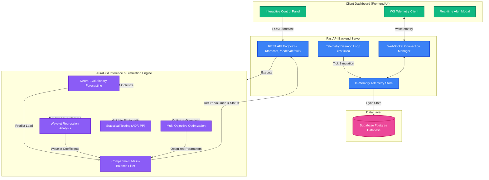

# ⚡ AuraGrid

[](https://python.org)
[](https://fastapi.tiangolo.com)
[](https://supabase.com)
[](https://cloud.google.com/run)

> **State-of-the-art Real-time Smart Grid Forecasting & Ingestion Engine.**  
> **Designed specifically for lower-tier and higher-tier Indian cities to optimize power distribution and prevent cascading failures.**  
> Solely Designed and Engineered by **Kanishk Yadav**, Lead Engineer and Developer.

---

## 📋 Table of Contents
- [Project Overview](#-project-overview)
- [System Architecture](#-system-architecture)
- [Key Features](#-key-features)
- [Multi-Tier Indian Grid Topology & Testing](#-multi-tier-indian-grid-topology--testing)
- [Local Setup & Installation](#-local-setup--installation)
- [Google Cloud Deployment](#-google-cloud-deployment)
- [Credits & Authorship](#-credits--authorship)

---

## 🔍 Project Overview

**AuraGrid** is an advanced telemetry ingestion, forecasting, and simulation platform engineered specifically to handle the unique challenges of electrical distribution networks across **lower-tier and higher-tier Indian cities**.

Indian power grids experience highly dynamic load variations, ranging from rapid industrial surges in manufacturing hubs to fluctuating household demands. AuraGrid combines cutting-edge neuro-evolutionary algorithms and wavelet regression methods with rigorous statistical testing to predict load patterns and prevent cascading failures.

To validate the engine under real-world conditions, the platform was successfully **tested and calibrated using the Bengaluru BESCOM Network topology**.

---

## 🏛️ System Architecture

AuraGrid's data flow is structured to handle concurrent forecasting calculations, live database synchronization, and low-latency client broadcasts:



---

## ✨ Key Features

*   **🧠 Neuro-Evolutionary Forecasting**:
    *   Employs advanced evolutionary algorithms that adaptively optimize neural network architectures for dynamic load prediction.
    *   Dynamically adapts to changing grid conditions and seasonal variations in Indian electrical networks.
    *   Robust against high volatility signatures characteristic of lower-tier Indian cities with irregular industrial schedules.

*   **📊 Wavelet Regression Analysis**:
    *   Decomposes time-series data using multi-scale wavelet transforms for detailed frequency and temporal analysis.
    *   Captures both short-term transients and long-term trends in power consumption patterns.
    *   Enables precise identification of load components across multiple time scales.

*   **📈 Statistical Validation (ADF & PP Tests)**:
    *   Performs Augmented Dickey-Fuller (ADF) and Phillips-Perron (PP) tests to ensure time-series stationarity.
    *   Validates data quality and identifies structural breaks in the grid load patterns.
    *   Ensures forecasting models operate on statistically sound foundations.

*   **🎯 Multi-Objective Optimization**:
    *   Optimizes multiple competing objectives: accuracy, latency, and resource utilization.
    *   Balances forecasting precision against computational efficiency for real-time operations.
    *   Enables Pareto-optimal decision-making for grid management strategies.

*   **🛡️ Cascading Failure Prevention**:
    *   Simulates grid flows using a Compartment Mass-Balance Filter to calculate node volumes over a 12-to-24 hour horizon.
    *   Detects boundary violations and automatically flags and **isolates** failed nodes (severing connections to prevent cascading network failures across municipal limits).

*   **⚡ Real-Time Streaming (WebSockets)**:
    *   Features a persistent background Telemetry Ingestion Daemon ticking every 2 seconds.
    *   Broadcasts live grid health, log volumes, and alerts to all connected WebSockets.

*   **💾 Supabase Sync & Row Level Security (RLS)**:
    *   Supports dynamic synchronization between local storage, in-memory configurations, and Supabase database tables.
    *   Leverages database RLS policies allowing clients to read raw telemetry while routing writes securely through the backend.

---

## 🗺️ Multi-Tier Indian Grid Topology & Testing

AuraGrid is configurable for different cities via environment settings. The reference deployment was calibrated and tested against a three-node transmission cycle representing typical municipal hierarchies across Indian states.

| Calibrated Node | Typology Category | Capacity Limits (Min / Max) | Role in Indian Grids |
| :--- | :--- | :--- | :--- |
| **Sharavathi Hydro Hub** | Generation Hub | 20.0 / 1500.0 Units | Hydro/Thermal Generation Plant supplying municipal grids. |
| **Koramangala Residential** | Consumer Hub | 20.0 / 1000.0 Units | High volatility residential consumer load (tested on BESCOM). |
| **Whitefield Industrial** | Industrial Hub | 20.0 / 1200.0 Units | Heavy load industrial manufacturing zone with peak shifting. |

---

## ⚙️ Local Setup & Installation

### 1. Requirements
*   Python 3.10 or 3.11
*   Supabase Account (Database instance)

### 2. Standard Installation

```bash
# Clone the repository
git clone <your-repository-url>
cd AURAGRID

# Set up the virtual environment
python -m venv venv
source venv/bin/activate  # On Windows: venv\Scripts\activate

# Install requirements
pip install -r requirements.txt
```

### 3. Configuration

You can customize AuraGrid for any Indian city (e.g., Delhi, Pune, Patna, Lucknow) using environment variables. 

Create a `.env` file at the root of the repository:

```env
SUPABASE_URL=https://your-project.supabase.co
SUPABASE_KEY=your-supabase-anon-key
GRID_APP_NAME="AuraGrid Utility Telemetry Service"
GRID_CITY_NAME="Pune Grid (MSEDCL Network)" # Example configuration for Tier-2/Tier-1 Pune
```

### 4. Running the Server

Launch the ASGI server with hot reloading enabled:

```bash
uvicorn app.main:app --reload --host 0.0.0.0 --port 8000
```
- Interactive API Docs: [http://localhost:8000/docs](http://localhost:8000/docs)
- Control Dashboard: [http://localhost:8000/static/index.html](http://localhost:8000/static/index.html)

---

## 🚢 Google Cloud Deployment

AuraGrid is optimized for deployment to **Google Cloud Run** using containerized Docker environments. 

For complete documentation regarding gcloud configuration, WSL (Windows Subsystem for Linux) setup, building with Cloud Build, and secure secret management, read the dedicated [GCP Deployment Walkthrough](./docs/gcp-deployment.md).

---

## 💎 Credits & Authorship

AuraGrid is designed, engineered, and developed from the ground up solely by:

**Kanishk Yadav**  
*Lead Engineer & Developer*  

All system components, from mathematical forecasting models to real-time streaming architectures, are proprietary works.
